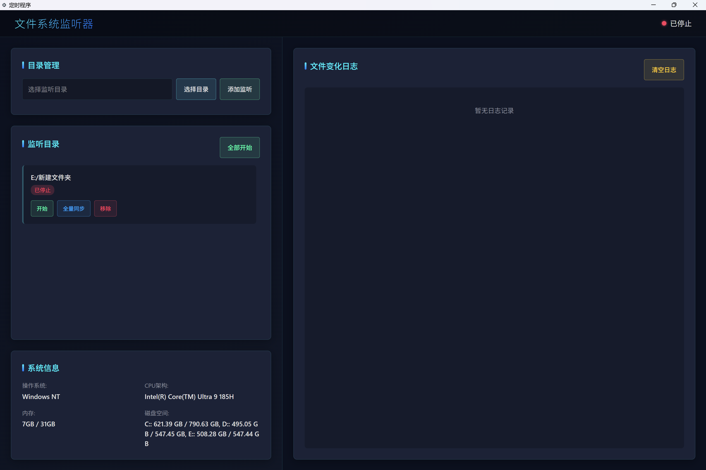

# 文件系统监听器 (File System Watcher)

一个基于 Neutralinojs 和 React 构建的跨平台桌面应用程序，用于实时监控目录文件变化并将数据同步到 ClickHouse 数据库。

## 🖼️ 软件截图



## 🚀 功能特性

### 核心功能
- **实时文件监控**: 监听指定目录的文件变化（创建、修改、删除）
- **多目录管理**: 支持同时监控多个目录
- **数据同步**: 将文件内容同步到 ClickHouse 数据库
- **系统监控**: 实时显示系统资源使用情况
- **日志记录**: 详细的操作日志和文件变化记录

### 技术特性
- **跨平台**: 基于 Neutralinojs 构建，支持 Windows、macOS、Linux
- **高性能**: 使用 Rust 扩展处理文件操作
- **现代化 UI**: 基于 React + Tailwind CSS 构建
- **数据存储**: 集成 ClickHouse 数据库进行大数据存储
- **本地存储**: 使用 Neutralino 存储 API 保存配置

## 📋 系统要求

- **操作系统**: Windows 10+, macOS 10.14+, Ubuntu 18.04+
- **内存**: 最低 4GB RAM
- **磁盘空间**: 至少 1GB 可用空间
- **网络**: 需要连接到 ClickHouse 数据库服务器

## 🛠️ 安装和运行

### 1. 克隆项目
```bash
git clone <repository-url>
cd neu-fs
```

### 2. 安装依赖
```bash
# 安装 Neutralinojs CLI (如果未安装)
npm install -g @neutralinojs/neu

# 安装前端依赖
cd react-vite
bun install
cd ..
```

### 3. 配置数据库
在 `react-vite/src/App.jsx` 中配置 ClickHouse 连接信息：
```javascript
const clickhouseClient = createClient({
    url: 'http://your-clickhouse-server:8123/',
    username: 'your-username',
    password: 'your-password',
    database: 'your-database'
});
```

### 4. 运行开发环境
```bash
neu run
```

### 5. 构建生产版本
```bash
neu build
```

## 🎯 使用指南

### 添加监听目录
1. 点击"选择目录"按钮选择要监控的文件夹
2. 点击"添加监听"将目录添加到监控列表
3. 点击"开始"按钮开始监控该目录

### 批量操作
- **全部开始**: 同时开始监控所有已添加的目录
- **全部停止**: 同时停止所有目录的监控
- **全量同步**: 将目录中的所有文件同步到数据库

### 查看日志
- 右侧面板显示实时的文件变化日志
- 支持清空日志功能
- 日志包含时间戳和操作类型

### 系统信息
左侧面板显示：
- 操作系统信息
- CPU 架构
- 内存使用情况
- 磁盘空间使用情况

## 🏗️ 项目结构

```
neu-fs/
├── neutralino.config.json    # Neutralinojs 配置文件
├── react-vite/              # React 前端应用
│   ├── src/
│   │   ├── App.jsx          # 主应用组件
│   │   ├── App.css          # 应用样式
│   │   └── main.jsx         # 应用入口
│   ├── package.json         # 前端依赖配置
│   └── vite.config.js       # Vite 配置
├── rust/                    # Rust 扩展
│   ├── src/main.rs          # Rust 扩展主文件
│   └── Cargo.toml           # Rust 依赖配置
└── resources/               # 应用资源
    ├── app.ico              # 应用图标
    └── extensions/          # 编译后的扩展
```

## 🔧 技术栈

### 前端
- **React 19**: 用户界面框架
- **Tailwind CSS**: 样式框架
- **Vite**: 构建工具
- **Neutralinojs**: 桌面应用框架

### 后端
- **Rust**: 高性能文件处理扩展
- **ClickHouse**: 列式数据库
- **Neutralinojs API**: 系统 API 调用

### 开发工具
- **Bun**: JavaScript 运行时和包管理器
- **ESLint**: 代码质量检查
- **PostCSS**: CSS 处理工具

## 📊 数据库结构

应用会将文件信息同步到 ClickHouse 的 `file_contents` 表：

```sql
CREATE TABLE file_contents (
    file_name String,
    file_path String,
    file_size UInt64,
    content String,
    last_modified DateTime,
    extension String
) ENGINE = MergeTree()
ORDER BY (file_path, last_modified);
```

## 🔒 安全注意事项

- 请确保 ClickHouse 数据库连接信息的安全性
- 建议在生产环境中使用环境变量存储敏感信息
- 定期备份监控配置和日志数据

## 🐛 故障排除

### 常见问题

1. **无法启动应用**
   - 检查是否安装了所有依赖
   - 确认 Neutralinojs CLI 版本兼容性

2. **文件监控不工作**
   - 检查目录权限
   - 确认目录路径正确
   - 查看控制台错误信息

3. **数据库连接失败**
   - 检查网络连接
   - 验证数据库配置信息
   - 确认 ClickHouse 服务运行状态

### 日志查看
- 应用日志显示在右侧面板
- 开发模式下可查看浏览器控制台
- Rust 扩展日志通过 `simple_logger` 输出

## 🤝 贡献指南

1. Fork 项目
2. 创建功能分支 (`git checkout -b feature/AmazingFeature`)
3. 提交更改 (`git commit -m 'Add some AmazingFeature'`)
4. 推送到分支 (`git push origin feature/AmazingFeature`)
5. 打开 Pull Request

## 📄 许可证

本项目采用 MIT 许可证 - 查看 [LICENSE](LICENSE) 文件了解详情。

## 📞 支持

如果您遇到问题或有建议，请：
1. 查看 [Issues](../../issues) 页面
2. 创建新的 Issue 描述问题
3. 提供详细的错误信息和复现步骤

---

**注意**: 这是一个开发中的项目，功能可能会发生变化。请定期检查更新。
